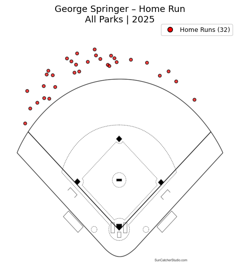
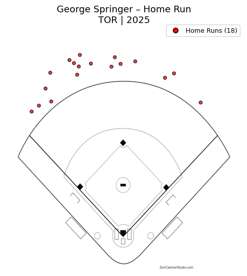
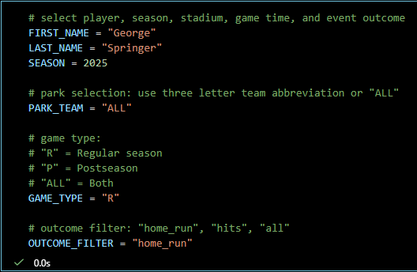
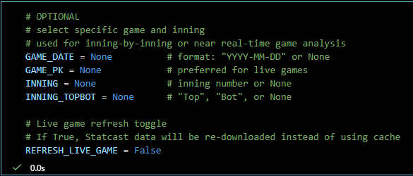
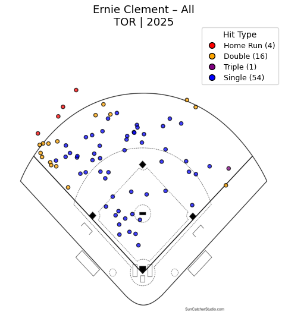

# MLB Hit Spray Chart
MLB Statcast data used to generate a spray chart visualization. Visualization can be updated inning by inning during a live game, or used for post-game and season-long analysis.

The notebook is designed to allow users to filter by player, park, game, inning, and outcome. The visualization can be quickly re-run as new data becomes available.

**This project is suitable for:**
- Live or post-game analysis
- Player-specific batted-ball profiling
- Portfolio demonstrations for baseball analytics roles
- Educational walkthroughs of Statcast data usage

**Primary goal of this project is near real-time game tracking:**
During a live game, the user can:
- Select a specific game using `GAME_PK`
- Update the inning and half-inning (`INNING`, `INNING_TOPBOT`)
- Refresh Statcast data
- Re-render the spray chart to reflect the current game state

**What visualization shows:**
- Batted-ball locations using Statcast spray coordinates (hc_x, hc_y)
- Field image aligned to Statcast coordinate space
- Color-coded hit types
- Legend with event totals when viewing all hits

**Player selection via Statcast ID lookup:**
- Season and game type filtering (regular season / postseason)
- Park filtering or league-wide views
- Outcome filtering (home runs, all hits, or custom selections)
- Game-specific and inning-specific filtering
- CSV caching to avoid repeated API calls
- Optional live refresh mode for in-game use

**Notebook structure:**
- Configuration (player, season, game context)
- Utility functions (ID lookup, data handling)
- Data loading and caching
- Filtering logic
- Visualization logic

**Data source:**
- Data is retrieved using pybaseball, interfacing with MLB’s Statcast / Baseball Savant API.
- Cached CSV files are stored locally to improve performance and reduce redundant queries.

**Requirements:**
- import os
- import numpy as np
- import pandas as pd
- import matplotlib.pyplot as plt
- import matplotlib.image as mpimg
- from matplotlib.lines import Line2D
- from pybaseball import statcast_batter, playerid_lookup
